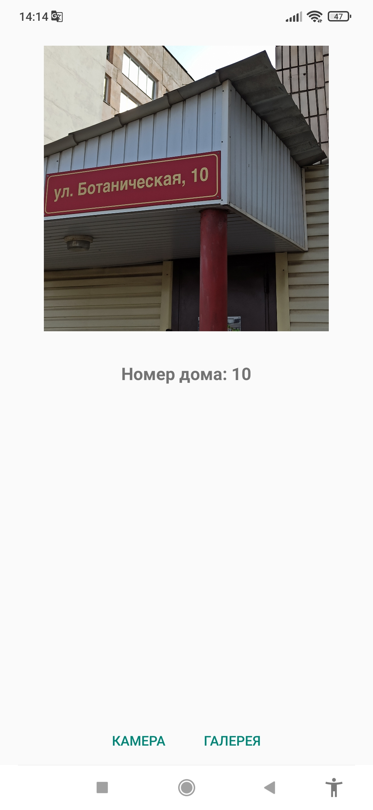

## Определение номера дома

Мобильное приложение определяет номер дома на фотографии.
Для распознавания цифр используется нейронная сеть, разработанная в 4 лабораторной работе.
Модель YOLOv5 определяет положение цифр на фотографии.

### Пример работы приложения

    
    
    
    

### Разработка

Приложение разработано на языке программирования Kotlin в Android Studio 2024.
Для установки на Android можно воспользоваться файлом [ml-android-app.apk](ml-android-app.apk).
Модель YOLOv5 была взята из репозитория 
[yolov5-svhn-detection](https://github.com/joycenerd/yolov5-svhn-detection).